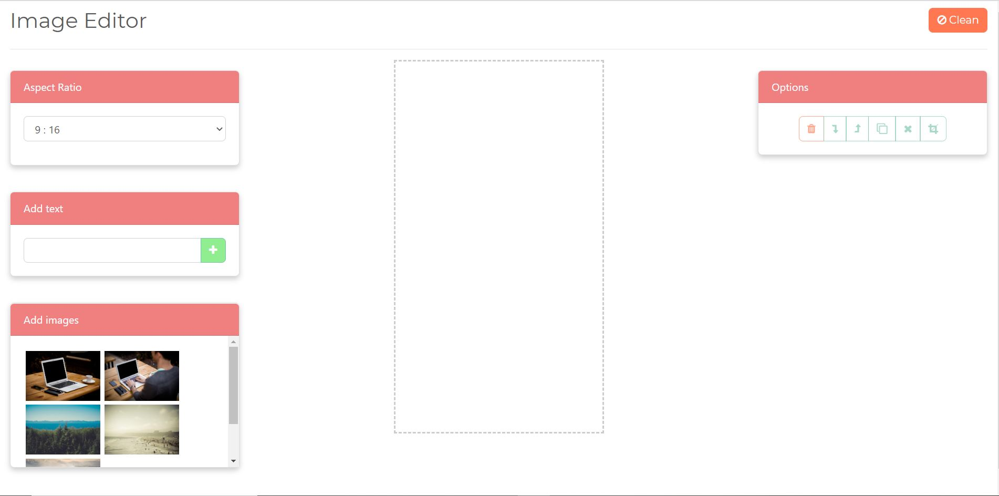

# Image Editor-AngularJS
Angular App for Image editing supporting features of Fabric.js and HTML5 Canvas Library 

## Installing the project

```bash
git clone https://github.com/kjain3474/ImageEditor-AngularJS.git
cd ImageEditor
npm install
```
## Start

Run `npm start` for a dev server. Navigate to `http://localhost:4200/`. The app will automatically reload if you change any of the source files.

## ScreenShot

